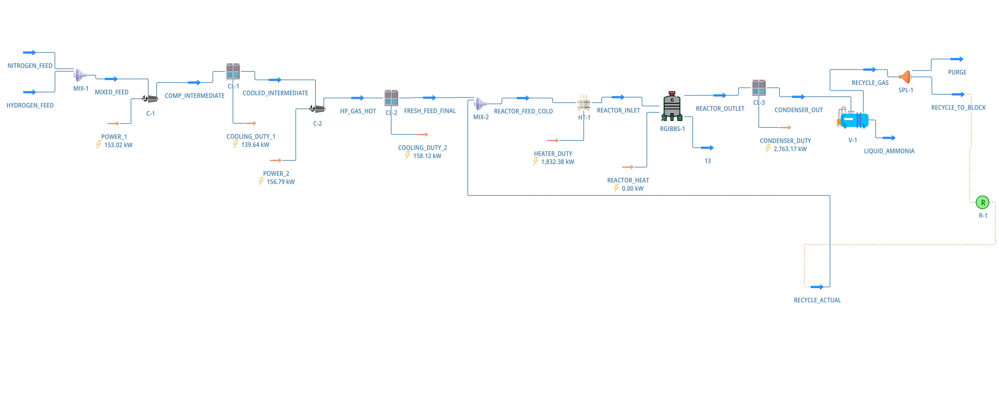
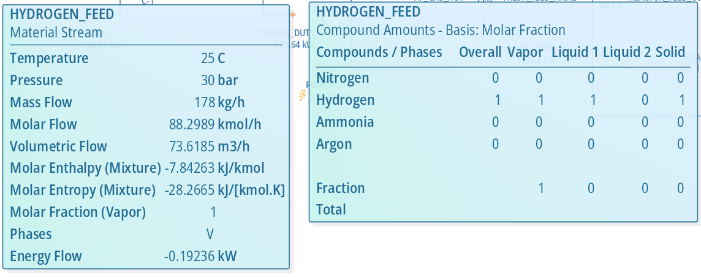
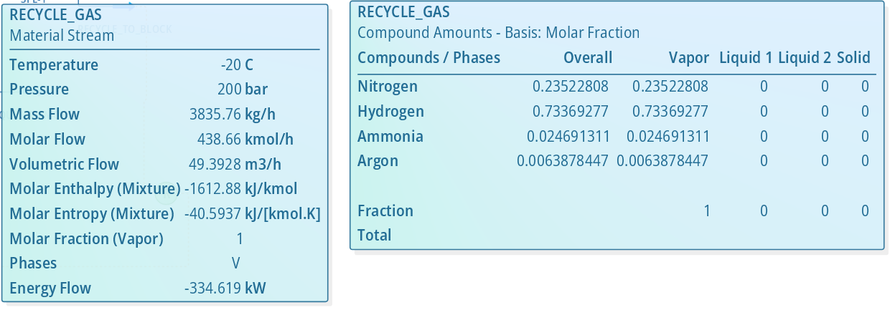
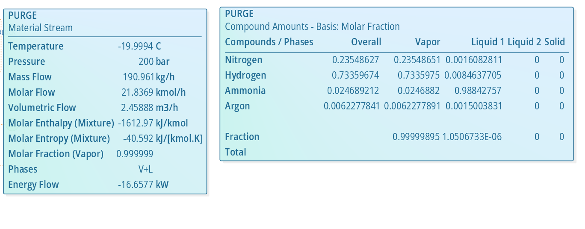
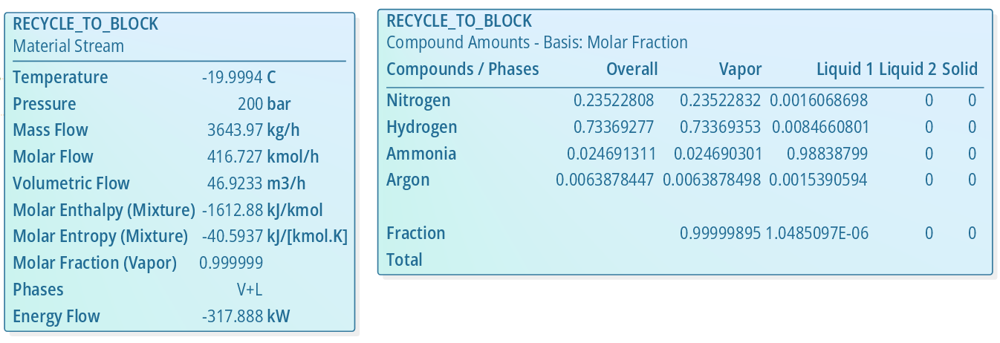
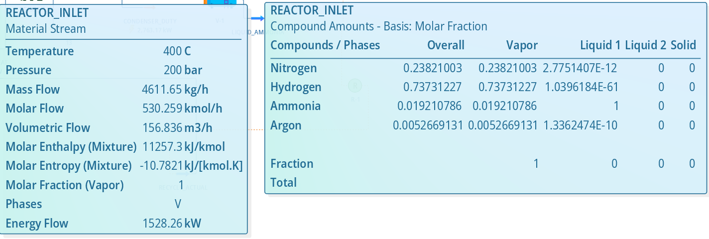
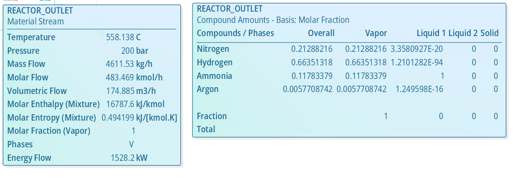
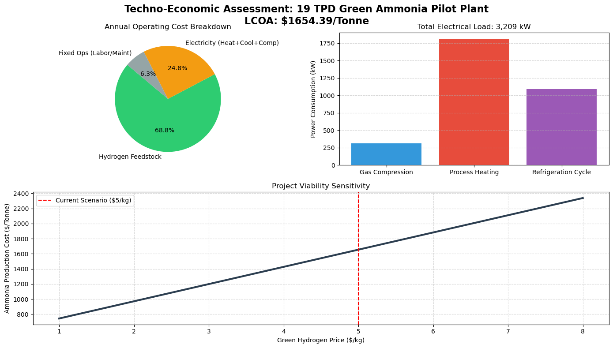

# TECHNO-ECONOMIC ANALYSIS AND PROCESS OPTIMIZATION OF A 19 TPD GREEN AMMONIA PILOT PLANT

**Author:** Hetram
>
**Tool:** DWSIM Open Source Process Simulator & Python

---

## 📋 EXECUTIVE SUMMARY

This project aimed to design, simulate, and perform a techno-economic assessment (TEA) of a pilot-scale Green Ammonia production plant with a target capacity of approximately 20 Tonnes Per Day (TPD). The primary objective was to evaluate the technical feasibility of coupling green hydrogen (from electrolysis) with nitrogen separation, followed by a rigorous economic analysis to determine the Levelized Cost of Ammonia (LCOA).

A steady-state simulation was developed using **DWSIM software**, utilizing the Peng-Robinson equation of state. The process features a high-pressure (200 bar) Haber-Bosch synthesis loop operating at 400°C. Product recovery is achieved via a cryogenic separation unit operating at -20°C.

### Key Results
* **Production:** The plant achieved a stable production rate of **18.75 TPD (781.55 kg/h)** of liquid ammonia with a purity of **98.85 wt%**, meeting commercial-grade standards.
* **Process Efficiency:** An overall hydrogen conversion efficiency of **92.4%** was achieved through the implementation of a recycle loop with a 5% purge ratio.
* **Economic Analysis:** Based on a green hydrogen feedstock cost of **$5.00/kg** and industrial electricity at **$0.10/kWh**, the LCOA was calculated to be **$1,654 per tonne**. This indicates a significant "green premium" compared to conventional grey ammonia (~$400–$600/tonne).

### Critical Analysis Findings
A forensic engineering analysis revealed critical areas for optimization:
1.  **Reactor Safety:** The adiabatic temperature rise across the reactor was **158°C**, exceeding safe operating limits for standard catalysts, indicating the need for a quench-style reactor design.
2.  **Hydrogen Loss:** The purge stream, necessary to manage inert argon buildup, was found to contain **73% hydrogen**, representing a financial loss of approximately **$1.2 million annually**.
3.  **Energy Intensity:** The process requires significant heating (1.8 MW) and refrigeration (1.1 MW electrical equivalent), resulting in a specific energy consumption of **4.1 kWh/kg NH3**, highlighting the urgent need for heat integration.

The study concludes that while technically feasible, the economic viability of green ammonia is highly sensitive to hydrogen feedstock costs and requires advanced energy and material recovery systems to be competitive.

---

## 📑 TABLE OF CONTENTS

1.  [Introduction](#1-introduction)
2.  [Process Theory and Design Basis](#2-process-theory-and-design-basis)
3.  [Simulation Methodology](#3-simulation-methodology)
4.  [Results and Technical Analysis](#4-results-and-technical-analysis)
5.  [Techno-Economic Analysis (TEA)](#5-techno-economic-analysis-tea)
6.  [Discussion and Recommendations for Optimization](#6-discussion-and-recommendations-for-optimization)
7.  [Conclusion](#7-conclusion)
8.  [References](#8-references)

---

## 1. INTRODUCTION

Ammonia ($NH_3$) is an essential global commodity, primarily used for fertilizer production. Conventional "grey" ammonia production via steam methane reforming accounts for approximately 1-2% of global $CO_2$ emissions. The transition to a net-zero economy necessitates the development of "green" ammonia, produced using hydrogen derived from water electrolysis powered by renewable energy, and nitrogen separated from the air.

Beyond agriculture, green ammonia is increasingly viewed as a viable dense energy carrier for hydrogen transport and a potential carbon-free maritime fuel.

The objective of this project is to develop a rigorous thermodynamic simulation of a green ammonia synthesis loop to define mass and energy balances. Subsequently, a techno-economic analysis is performed to quantify the capital and operating costs, identify technical bottlenecks, and evaluate the economic sensitivity to key input parameters like hydrogen pricing.

---

## 2. PROCESS THEORY AND DESIGN BASIS

### 2.1. The Chemistry
Ammonia synthesis is governed by the reversible, exothermic Haber-Bosch reaction:

$$N_{2(g)} + 3H_{2(g)} \rightleftharpoons 2NH_{3(g)} \quad \Delta H^\circ_{298K} = -92.4 \text{ kJ/mol}$$

According to Le Chatelier’s principle:
* **Pressure:** Since 4 moles of gaseous reactants produce 2 moles of gaseous product, high pressure favors the forward reaction (ammonia production). Industrial practice typically utilizes 150–250 bar.
* **Temperature:** Since the reaction is exothermic, lower temperatures favor the equilibrium yield. However, low temperatures result in kinetically slow reaction rates. Therefore, an industrial compromise temperature range of 350°C–550°C is used in the presence of an iron-based catalyst.

### 2.2. Design Basis and Assumptions
The simulation rests on the following design parameters for a decentralized, pilot-scale facility:

| Parameter | Value | Description |
| :--- | :--- | :--- |
| **Target Capacity** | ~1000 kg/h (24 TPD) | Pilot Scale Basis |
| **Thermodynamic Model** | Peng-Robinson (PR) | Equation of State suitable for high-pressure non-ideal gases. |
| **Hydrogen Feed** | Pure $H_2$ | Assumed from PEM/Alkaline Electrolysis at 30 bar, 25°C. |
| **Nitrogen Feed** | 99% $N_2$, 1% Ar | Assumed from Cryogenic Air Separation Unit (ASU) at 20 bar, 25°C. Argon acts as an inert. |
| **Loop Operating Pressure**| 200 bar | Target synthesis pressure. |
| **Reactor Inlet Temp** | 400°C | Required catalyst activation temperature. |
| **Separation Temp** | -20°C | Cryogenic separation required for high recovery at lower pass conversions. |

---

## 3. SIMULATION METHODOLOGY

The simulation was developed in DWSIM following a sequential modular approach.

### 3.1. Thermodynamics and Component Setup
The simulation was initialized using the **Peng-Robinson (PR)** Equation of State. The component list included Hydrogen ($H_2$), Nitrogen ($N_2$), Ammonia ($NH_3$), and Argon ($Ar$). The inclusion of Argon is critical for realistic industrial modeling as it accumulates in the recycle loop, necessitating a purge stream.

### 3.2. Feed Stream Definition
Two material streams were created to define the raw materials. Flows were selected to approximate a stoichiometric molar ratio of 3:1 ($H_2$:$N_2$).
* **`NITROGEN_FEED`:** 825 kg/h at 20 bar, 25°C. Composition: 0.99 mole frac $N_2$, 0.01 mole frac Ar.
* **`HYDROGEN_FEED`:** 178 kg/h at 30 bar, 25°C. Composition: 1.0 mole frac $H_2$.

>
> 
## Ammonia Synthesis Flowsheet

### 3.3. The Compression Train
To raise the feed pressure from ~20 bar to the target loop pressure of 200 bar, a multistage compression strategy with intercooling was employed to manage temperature rise and reduce compressor work.

1.  **Mixing:** Feeds were combined in mixer `MIX-1`.
2.  **Stage 1 Compression (`C-1`):** Compressed the mixed feed to an intermediate pressure of 65 bar (Adiabatic Efficiency: 75%).
3.  **Intercooling (`CL-1`):** Cooled the discharge gas to 40°C.
4.  **Stage 2 Compression (`C-2`):** Compressed the stream to the final loop pressure of 200 bar.
5.  **Aftercooling (`CL-2`):** Cooled the high-pressure fresh feed to 40°C.

### 3.4. Synthesis Loop and Reactor Setup
The core synthesis loop was constructed using a "mix-heat-react-cool" sequence.

1.  **Recycle Mixer (`MIX-2`):** Combines fresh feed with the recycle stream.
2.  **Pre-Heater (`HT-1`):** Heats the feed stream to the reaction ignition temperature of 400°C.
3.  **Reactor (`RGIBBS-1`):** A Gibbs Minimization reactor was selected to model equilibrium-limited conversion. The reactor was set to **Adiabatic mode** (Heat Duty = 0 kW) to simulate industrial packed beds where the exothermic heat raises the product gas temperature.
4.  **Condenser (`CL-3`):** The hot reactor effluent is cooled to **-20°C**. This aggressive cooling is necessary to liquefy ammonia for separation from the unreacted gases.

### 3.5. Product Separation and Recycle System (V-1 & SPL-1)
This section details the critical Vapor-Liquid Equilibrium (VLE) separation unit and the recycle splitting mechanism required to maintain loop efficiency.

**Unit V-1: High-Pressure Flash Separator (Ammonia Separator)**
* **Component ID:** `V-1`
* **Type:** Vapor-Liquid Separator (Flash Drum)
* **Function:** Performs phase separation of the cooled reactor effluent. Due to the high boiling point of Ammonia (-33.34°C) compared to Hydrogen (-252°C) and Nitrogen (-195°C), cooling the stream to -20°C condenses the Ammonia while keeping reactants in the gas phase.
* **Streams:**
    * **Bottom Outlet (`LIQUID_AMMONIA`):** High-purity Liquid Ammonia product.
    * **Top Outlet (`RECYCLE_GAS`):** Unreacted Hydrogen and Nitrogen, plus accumulated inerts.

> 
>

**Unit SPL-1: Purge Splitter**
* **Component ID:** `SPL-1`
* **Type:** Flow Splitter
* **Function:** Splits the `RECYCLE_GAS` stream into two paths: **Recycle** and **Purge**.
* **Critical Design Note:** Without this splitter, inert gases (Argon) would accumulate in the recycle loop, lowering the partial pressure of reactants and eventually stopping the reaction.
* **Operation:** A **5% purge ratio** was selected to keep Argon concentration below 5% in the loop.

>
>

### 3.6. Closing the Recycle Loop and Troubleshooting
Closing the recycle loop is the most critical and unstable step in process simulation.

**Successful Implementation Strategy:**
To stabilize the loop and ensure convergence at 200 bar, the following steps were taken:
1.  **Purge Splitter (`SPL-1`):** As described above, 5% of the flow is vented.
2.  **Recycle Booster Compressor (`RECYCLE_BOOSTER`):** A compressor block was added to the 95% recycle stream to ensure its pressure was exactly 200 bar before re-entering the mixer. This resolved the "pressure collapse" issue common in loop simulations.
3.  **Recycle Logical Block (`R-1`):** A recycle convergence block using Direct Substitution acceleration was employed to manage the iterative calculations required to match assumed and calculated recycle flows.

>

---

## 4. RESULTS AND TECHNICAL ANALYSIS

The simulation successfully converged to a stable steady-state operation.

### 4.1. Overall Mass Balance and Production
The plant achieved a liquid ammonia production rate of **781.55 kg/h**, translating to approximately 18.75 Tonnes Per Day. The final product stream (`LIQUID_AMMONIA`) has a purity of **98.85 wt%**, which meets standard industrial technical requirements.

| Stream Name | Temp (°C) | Pressure (bar) | Mass Flow (kg/h) | Key Composition |
| :--- | :--- | :--- | :--- | :--- |
| Fresh Feed (Final) | 40 | 200 | 1003 | $N_2$/$H_2$ mix |
| Reactor Inlet | 400 | 200 | 4552 | Mixed Feed + Recycle |
| Reactor Outlet | 558 | 200 | 4552 | ~15% $NH_3$ (mass) |
| **Liquid Ammonia (Product)** | **-20** | **200** | **781.55** | **98.85% $NH_3$** |
| Purge Stream | -20 | 200 | 188.5 | **73% $H_2$ (molar)** |

### 4.2. Reactor Performance and Thermal Safety
Hovering over the reactor streams revealed critical operational data.

>
>
>

* **Single-Pass Conversion:** The mass balance across the reactor indicates a single-pass conversion of approximately 17.1%. This low conversion necessitates the high recycle ratio utilized in the design.
* **Thermal Analysis (Delta-T):** The adiabatic nature of the reaction caused a temperature rise ($\Delta T$) of **158°C** (from 400°C inlet to 558°C outlet).
    * *Engineering Assessment:* This temperature rise is dangerously high for a single catalyst bed. Standard iron catalysts begin to sinter and lose activity above 500°C. While thermodynamically valid in the simulation, a real-world design would require a multi-bed quench converter to manage temperatures within safe limits (e.g., keeping peak T < 500°C).

### 4.3. Energy Audit
A detailed audit of energy consumers was conducted to determine the plant's energy intensity.

| Equipment Tag | Description | Duty/Power (kW) | Note |
| :--- | :--- | :--- | :--- |
| C-1 / C-2 | Feed Compressors | 309.8 kW | Electrical Load |
| RECYCLE_BOOSTER | Recycle Compressor | ~20.0 kW | Electrical Load |
| HT-1 | Feed Pre-Heater | **1,808.2 kW** | Thermal Load (High) |
| CL-3 | Product Condenser (-20°C)| 2,727.8 kW (Thermal)| Requires Refrigeration |

* **Refrigeration Load:** The condenser requires cooling to -20°C. Assuming a standard ammonia refrigeration cycle with a Coefficient of Performance (COP) of 2.5, the electrical load for this unit is estimated at $2727.8 / 2.5 \approx \mathbf{1,091 \text{ kW}_{electrical}}$.
* **Total Electrical Load:** Assuming the heater is also electric to maintain a "green" status, the total plant load is approximately **3.2 MW**.

---

## 5. TECHNO-ECONOMIC ANALYSIS (TEA)

A Levelized Cost of Ammonia (LCOA) analysis was performed based on the simulation data to assess economic viability.

### 5.1. Economic Parameters and Assumptions
* **Green Hydrogen Price:** $5.00 per kg (Current 2023/2024 estimate for electrolytic hydrogen).
* **Industrial Electricity Price:** $0.10 per kWh.
* **Plant Availability:** 90% (approx. 8,000 operating hours per year).
* **CAPEX Estimate:** $4.5 Million (Order-of-magnitude estimate for a 20 TPD pilot plant).

### 5.2. Operating Expenditure (OPEX) Calculation
Based on the mass and energy balances derived from DWSIM:

1.  **Annual Feedstock Cost (Hydrogen):**
    $$178 \text{ kg/h} \times \$5.00/\text{kg} \times 8,000 \text{ h/yr} = \$7,120,000 \text{/yr}$$
2.  **Annual Energy Cost (Electricity):**
    $$3,229 \text{ kW} \times \$0.10/\text{kWh} \times 8,000 \text{ h/yr} = \$2,583,200 \text{/yr}$$
3.  **Total Annual OPEX (excluding fixed costs):** **$9,703,200 /yr**

### 5.3. Levelized Cost of Ammonia (LCOA)
* **Annual Production:** $781.55 \text{ kg/h} \times 8,000 \text{ h/yr} \div 1000 \text{ kg/tonne} = \mathbf{6,252 \text{ tonnes/yr}}$
* **LCOA Calculation:**
    $$LCOA = \frac{\text{Total Annual Cost}}{\text{Annual Production}} \approx \frac{\$10,343,200 \text{ (incl. overhead)}}{\text{6,252 tonnes}} \approx \mathbf{\$1,654 \text{ per tonne}}$$

This calculated cost is significantly higher than current grey ammonia prices (~$400-$600/tonne), indicating a substantial "green premium" driven primarily by hydrogen feedstock costs.

### 5.4. Sensitivity Analysis
To evaluate the impact of future reductions in hydrogen electrolyzer costs, a sensitivity analysis was performed.

>

The analysis confirms that the project's viability is highly elastic to hydrogen pricing. LCOA approaches competitive levels only when hydrogen costs fall below $2.50/kg.

---

## 6. DISCUSSION AND RECOMMENDATIONS FOR OPTIMIZATION

The base-case simulation reveals several critical inefficiencies that must be addressed in a detailed engineering design.

### 6.1. Hydrogen Recovery from Purge Stream
Forensic analysis of the `PURGE` stream reveals a critical economic loss.

>

While necessary to remove inert Argon, this stream contains **73.3 mole% Hydrogen**. At a flow rate of 188.5 kg/h, the plant is venting approximately 30–40 kg/h of high-value green hydrogen.
* **Financial Impact:** This represents an annual loss of approximately **$1.2 Million**.
* **Recommendation:** Integrate a **Membrane Separation Unit** or **Pressure Swing Adsorption (PSA)** unit on the purge line. Recovering 90% of this hydrogen and recycling it to the reactor feed would significantly improve overall process efficiency and reduce LCOA.

### 6.2. Heat Integration
The process is currently highly energy-intensive, requiring 1.8 MW of high-temperature heating while simultaneously needing to cool down reactor effluent from 558°C.
* **Recommendation:** Replace the utility pre-heater (`HT-1`) with a **Feed-Effluent Heat Exchanger (FEHE)**. By using the hot reactor product gas to preheat the cold feed gas, external heating requirements could be reduced to near-zero during steady-state operation (autothermal operation), lowering specific energy consumption significantly.

---

## 7. CONCLUSION

A rigorous techno-economic assessment of a 19 TPD green ammonia pilot plant was successfully conducted. The DWSIM simulation validated the technical feasibility of the process at 200 bar, achieving 98.85% product purity through cryogenic separation.

However, the economic analysis indicates an LCOA of $1,654/tonne, which is currently uncompetitive with fossil-based ammonia. The project's viability is contingent upon:
1.  A reduction in green hydrogen feedstock costs to below $2.50/kg.
2.  Implementation of critical optimization strategies, specifically hydrogen recovery from the purge stream and aggressive heat integration, to reduce operating costs and energy intensity.

This study serves as a foundational basis for further detailed engineering design focused on improving the energy and material efficiency of the green ammonia synthesis loop.

---

## 8. REFERENCES
1.  DWSIM - Open Source Process Simulator.
2.  Appl, M. (1999). *Ammonia: Principles and Industrial Practice*. Wiley-VCH.
3.  International Energy Agency (IEA). (2023). *The Future of Hydrogen*.
4.  Turton, R., et al. (2018). *Analysis, Synthesis, and Design of Chemical Processes* (5th ed.). Pearson.